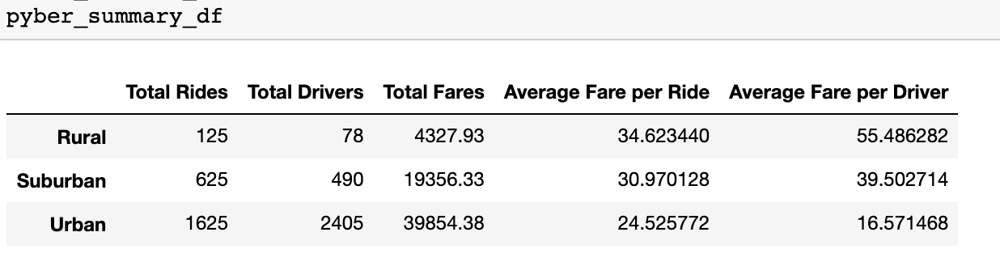

# PyBer Analysis

## Overview of Analysis
We were tasked with performing an analysis in order to compare ride-sharing data in relation to the different
types of cities. In the first part of this analysis, we were asked to create a summary Data Frame that 
shows information about fares, number of drivers and number of rides in each type of city
(Rural, Suburban and Urban). In the second part of the analysis, we were asked to get a line chart which 
depicts the total weekly fares for each city type.

## Tools/Languages used
For this analysis, we completed our analysis in Jupyter Notebook.
Python, Pandas and Matplotlib were used to complete the analysis.

## Results

### Summary Data Frame

Above shows the summary DataFrame we created. From this analysis, we can see some major differences between the different city types. We can see that in general, there are many more rides, fares and drivers in urban cities. This makes sense as urban cities tend to have higher, more dense populations with less people owning a car.
However, this has an inverse relationship to the average fares per ride and driver. With a higher frequency of rides and drivers, the average fare per ride is lower compared to the rural and suburban cities. The average fare per driver is actually less than half the average fare per driver in suburban and rural cities. There are a lot less drivers in rural towns and in turn, the fare per driver is much higher. 

### Total Weekly Fares for each City Type

Above is the line chart we created from our new pivoted DataFrame which compares the weeky fares for each city type. We were able to pivot the DataFrame to have date (binned into weeks) as our index and then have the total fares for each city type as our columns. From there we ploted our multiple line chart using object-oriented interface with Matplotlib and df.plot()function. We also used only a sample of the dates for this graph, to only show the trends from January through to the end of April.
From this graph we can see, similar to the DataFrame summary, that there are much higher total fares in urban cities. Rural cities/towns have the lowest amount of total fares (never reaching above $500 USD). However, this graph also shows us what months the fares are at their highest. This graph depicts a four month span (January through April). For urban cities, the fares hit their peaks at the end of February and beginning of March. The urban city fares seem to be at their lowest for this period of time at the beginning of the year (January).
Suburban cities hit their max total fares during late February as well (almost hitting $1500 USD).It seems that the fares do start to increase again in mid April as well.
Lastly for the rural cities/towns, we can see from this graph that highest total fares reached is right at the beginning of April (reaching $500 USD). There is a peak in the end of February as well, but overall the rural total fares do not flucuate as much and stay low during the entire 4 months. 

## Summary 

Overall, from our analysis, we can see that the number of drivers in a city directly affects how much total fares that city will bring in. It makes logical sense that there would be less drivers and rides taken in rural cities, as the population is smaller, less places to go etc.
However, more advertising and marketing or even incentives, could be put in place in these rural and suburban cities to get more drivers to sign up. If there are more drivers available, this will drive total fares up. 
Another way to look at this, would be looking at the average fare per ride in the summary DataFrame. There is not a massive difference of the fare per ride in each type of city. Since rural cities have less availability, it would make more sense for that fare per ride to go significantly up. If the fare per ride in rural cities was higher, because of the low demand, this may drive up total fares since people are paying more to get rides. This also could drive customers away though, so that would be something they would have to test out.
Our final way of looking at this is excluding the rural data. In general, rural cities will not be where a large portion of the money will be made, no matter what you change in advertising,incentives etc. Really, we believe getting the suburban total fares up would make large impact for the company. Focusing time and energy into these suburban cities would be the best use of time in our opinion. 
